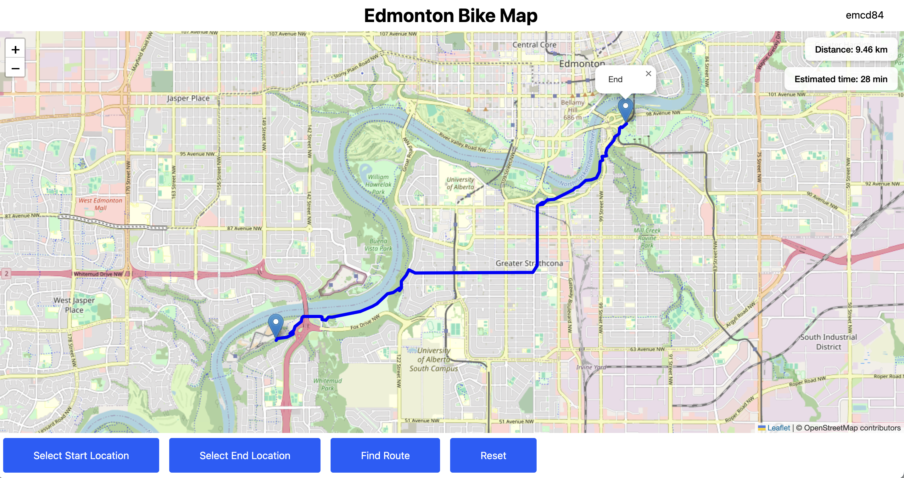
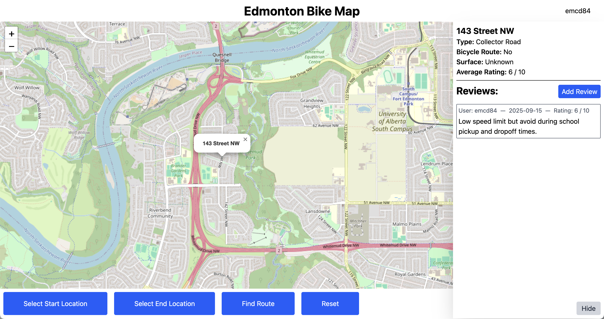

# Edmonton Bike Map

Finding a safe and comfortable bike route from one place to another isn't as simple as plugging in start and end addresses into Google Maps. I often find myself piecing together a route using a combination of a map of Edmonton's bike infastructure and Google Maps streetview to verify the suitability of different routes. Some roads are simply unsafe for bikes, while others may be uncomfortable. Even where bike infastructure is available, an adjacent quiet residential street might be more comfortable to ride on.

This website provides bike-specific routing and direction for Edmonton cyclists. It allows users to leave reviews on roads, paths, and bike lanes. These reviews then inform the routing algorithm, directing cyclists towards routes that are highly rated by themselves and others.

## Website

View the website here: [https://edmontonbikemap.xyz](https://edmontonbikemap.xyz)

This project is an MVP and is currently in active development. You can see planned features, enhancements, and fixes on the [issues page](https://github.com/ellismcdougald/edmonton-bike-map/issues).

## Screenshots

## Tech Stack

- Frontend: Svelte, TailwindCSS (deployed on Vercel)

- Backend: Go (deployed on DigitalOcean VPS)

- Database: PostgreSQL (hosted on the same VPS)

- Infrastructure & DevOps: Terraform for provisioning, Ansible for configuration, GitHub Actions for CI/CD
